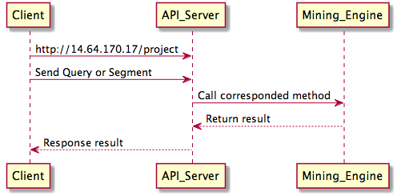

#**Search Mining - with word2Vector**
-------------------------
#Introduction
Analyzing user searches is an influential aspect in the field of ad revenue and e-commerce revenue. In addition, to any entity, whether it be a corporate or a research group, user searches directly provide knowledge of the target user base. Our project focuses analyzing users’ action patterns and has succeeded in providing value as a technology and a service.

In terms of technology, our project overcame the limitations of the “bag of word” method by utilizing a deep learning method “word2vec”. Implementing the deep learning method resulted in a meaningful improvement in categorizing search queries.

Analysis of user action pattern can provide links amongst gender classification, category classification and related queries. Hence, it can be used in service.

- Libraries : Sklearn, Gensim, Flask, Numpy, Pandas
- Authors : ILJI Choi (AppleHolic), Jude Lee (JudeLee19), HaeSeong Ji (Hsji123), Jaemyung Ryu (posjmss)

#Demo Webpage
http://14.63.170.17/project

#Sequence Diagram

#System Structure

#File Structure
| File Name  | Description |         
| :------------ | :-----------: |
| ResponseMachine.py     |  Search Mining Engine
| Models Directory     |  Contain trained models
| mining_server.py     |   API Server
| index.html     |   WebPage

# 소스 코드 리뷰

### 표현 >기계 학습 모델 >일반화

1. 표현(Representation) : Word Count, Word2Vec

2. 기계 학습 모델 :  SVM(Support Vector Machine)

3. 일반화 : 성별, 카테고리 '예측'

### sklearn : 기계 학습 모델 및 여러 가지 관련 툴 제공 라이브러리
### gensim : Word2Vec 등 최근 화두가 되고 있는 여러 알고리즘 제공
### pandas : 데이터 관리, 가공 등을 쉽게 할 수 있도록 하는 라이브러리
### numpy : 파이썬 수학, 배열 관련 라이브러리

# 데이터 마이닝 엔진 전체 소스

    # -*- coding: utf-8 -*-
    # -*- coding: utf-8 -*-
    import gensim
    import pandas as pd
    import numpy as np
    from sklearn.externals import joblib
    from sklearn.svm import SVC
    from sklearn.grid_search import GridSearchCV
    from sklearn.feature_extraction.text import CountVectorizer
    
    class ResponseClassifierRequests(object):
        """
        It will response requests for analyzing customers queries
        - Initializer : load whole modules(vectorizer, classifier)
        - Functions : 
        1. response_query : list of query >> dictionary of gender, category scores
        2. response_ranking : index of gender and category >> list of recommendations(top10 keywords on segment)
        3. get_gender_labels, get_category_labels (korean label names...)
        """
        __gender_labels=[
            '남성',
            '여성'
        ]
        __category_labels = [
            '식품', 
            '스포츠/레저', 
            '패션의류', 
            '여행/문화', 
            '생활/건강', 
            '출산/육아', 
            '가구/인테리어', 
            '디지털/가전', 
            '화장품/미용', 
            '패션잡화'
        ]
        
        #constructor, just call model loading function
        def __init__(self, topn=10):
            print 'Load modules and ranking frame....'
            self.__load_models__()
            print 'Cashing category ranking score....'
            self.__topn = topn
            self.__cashing_category_score()
            print 'Module is ready to be used'
    		 
        #load models and vectorizer
        def __load_models__(self):
            self.__gender_vectorizer = joblib.load(
                '../models/clf_gender_vectorizer.sv'
            )
            self.__gender_clf = joblib.load(
                '../models/clf_gender_model.sv'
            )
            self.__category_vectorizer = gensim.models.Word2Vec.load_word2vec_format(
                '../models/query_word2vec.list.all.e256.w5.model.bin', binary=True
            )
            self.__category_clf = joblib.load(
                '../models/seed_category.sv'
            )
            self.__gender_ranking_df = pd.DataFrame.from_csv(
                '../models/gender_ranking_base.csv'
            )
            self.__cate_ranking_df = pd.DataFrame.from_csv(
                '../models/category_ranking_base.csv'
            )
            self.__word_count_series = pd.Series.from_csv(
                '../models/word_count_series.csv'
            )
        
        def __get_related_queries(self, query, topn = 10):
            if query.decode('utf-8') in self.__category_vectorizer:
                
                #category
                cvector = self.__category_vectorizer[query.decode('utf-8')]
                category = self.__category_clf.predict_proba(cvector)
                category = sorted(enumerate(category[0]), reverse=True, key=lambda x : x[1])
                category = category[:3]
                print category
                words = {word : self.__category_clf.predict(self.__category_vectorizer[word])[0] for word, score in self.__category_vectorizer.most_similar(query.decode('utf-8'), topn=100) if self.__category_clf.predict(self.__category_vectorizer[word])[0] in [x[0] for x in category]}
                cate_result = {cate : [] for cate in words.values()}
                for word, cate in words.iteritems():
                    if len(cate_result[cate])<topn:
                        cate_result[cate].append(word)
                        
                #gender
                gender_similar = self.__category_vectorizer.most_similar(query.decode('utf-8'), topn=100)
                words = {0:[], 1:[]}
                for word, score in gender_similar:
                    pred = self.__gender_clf.predict(self.__gender_vectorizer.transform([word.encode('utf-8')]))
                    if len(words[pred[0]]) < topn:
                        words[pred[0]].append(word.encode('utf-8'))
                    if len(words[0]) >= topn and len(words[1]) >= topn:
                        break
    
                return words, cate_result
            else:
                return None
            
        #cashing topn query ranking list on each combinations of labels
        #self.cash_dict
        def __cashing_category_score(self):
            #gender df index match to cate_df
            self.__cate_ranking_df = self.__cate_ranking_df.reindex(
                columns = list(set([x.upper() for x in self.__cate_ranking_df.columns.values if len(x)>2]))
            )#handle missing preprocessing...
            gender_df_matched_cate = self.__gender_ranking_df.T.reindex(
                columns=self.__cate_ranking_df.columns
            )
            
            #concatenation both dataframe that are added combinations of labels
            concat_df = pd.concat([
                    self.__cate_ranking_df + gender_df_matched_cate.loc['남성', :],
                    self.__cate_ranking_df + gender_df_matched_cate.loc['여성', :]
                ])
            
            concat_df.index=range(len(concat_df))
            concat_df = concat_df.T
            
            #reindex from count lower bound
            lower10 = [idx for idx, x in self.__word_count_series.iteritems() if x >=15 and idx in concat_df.index]
            concat_df = concat_df.reindex(index=lower10)
            
            cash_dict = {}
            for g in xrange(len(self.__gender_labels)):
                cash_dict[g] = {}
                for c in xrange(len(self.__category_labels)):
                    idx = g * 10 + c
                    d = concat_df.sort(idx, ascending=False)
                    cash_dict[g][c] = [[x.decode('utf-8').encode('utf-8') for x in d.index[:self.__topn].values], d.values[:self.__topn, idx].tolist()]
            self.__cash_dict = cash_dict
        
        #Params : list of queries
        #Return : dictionary gender score, category score
        def response_query(self, queries):
            #vectorizing for predict
            if type(queries) is str:
                queries = queries.split()
            gvector = self.__gender_vectorizer.transform([' '.join(queries)])
            cvector = np.zeros(self.__category_vectorizer.vector_size)
            count = 0
            for query in queries:
                if query.decode('utf-8') in self.__category_vectorizer:
                    cvector += self.__category_vectorizer[query.decode('utf-8')]
                    count += 1
            if count == 0:
                return 'error: there is no match on dictionary'
            cvector /= count
            
            gender_related, cate_related = self.__get_related_queries(queries[0])
            return {
                'gender' : np.round(self.__gender_clf.predict_proba(gvector)*100, 2).tolist(),
                'category' : [map(list, zip(*[(self.__category_labels[i], s) for i, s in list(sorted(enumerate(np.round(self.__category_clf.predict_proba(cvector)*100, 2)[0]),key=lambda x : x[1]))[::-1]]))],
                'gender_related' : gender_related,
                'category_related' : cate_related
            }
        
        #Params : index of class
        #Return : topn ranking list
        def response_ranking(self, gender, category):
            if type(gender) is not int or type(category) is not int:
                return ''
            else:
                return self.__cash_dict[gender][category]
            
        def get_gender_labels(self):
            return self.__gender_labels
        
        def get_category_labels(self):
            return self.__category_labels

    Using gpu device 0: GeForce GTX 980 (CNMeM is disabled)

# 쿼리 반응 부분

##1. 2. 3. 쿼리 요청시
###1) 성별, 3) 카테고리 분류기의 스코어 값 리턴
###2) 유사도가 가장 높은 단어 목록 리턴

    def response_query(self, queries):
        #vectorizing for predict
        if type(queries) is str:
            queries = queries.split()
        gvector = self.__gender_vectorizer.transform([' '.join(queries)])
        cvector = np.zeros(self.__category_vectorizer.vector_size)
        count = 0
        for query in queries:
            if query.decode('utf-8') in self.__category_vectorizer:
                cvector += self.__category_vectorizer[query.decode('utf-8')]
                count += 1
        if count == 0:
            return 'error: there is no match on dictionary'
        cvector /= count
    
        gender_related, cate_related = self.__get_related_queries(queries[0])
        return {
            'gender' : np.round(self.__gender_clf.predict_proba(gvector)*100, 2).tolist(), #1.
            'category' : [map(list, zip(*[(self.__category_labels[i], s) for i, s in list(sorted(enumerate(np.round(self.__category_clf.predict_proba(cvector)*100, 2)[0]),key=lambda x : x[1]))[::-1]]))],
            #3.
            'gender_related' : gender_related,
            'category_related' : cate_related #2.
        }

    def __get_related_queries(self, query, topn = 10):
        if query.decode('utf-8') in self.__category_vectorizer:
    
            #category
            cvector = self.__category_vectorizer[query.decode('utf-8')]
            category = self.__category_clf.predict_proba(cvector)
            category = sorted(enumerate(category[0]), reverse=True, key=lambda x : x[1])
            category = category[:3]
            print category
            words = {word : self.__category_clf.predict(self.__category_vectorizer[word])[0] for word, score in self.__category_vectorizer.most_similar(query.decode('utf-8'), topn=100) if self.__category_clf.predict(self.__category_vectorizer[word])[0] in [x[0] for x in category]}
            cate_result = {cate : [] for cate in words.values()}
            for word, cate in words.iteritems():
                if len(cate_result[cate])<topn:
                    cate_result[cate].append(word)
    
            #gender
            gender_similar = self.__category_vectorizer.most_similar(query.decode('utf-8'), topn=100)
            words = {0:[], 1:[]}
            for word, score in gender_similar:
                pred = self.__gender_clf.predict(self.__gender_vectorizer.transform([word.encode('utf-8')]))
                if len(words[pred[0]]) < topn:
                    words[pred[0]].append(word.encode('utf-8'))
                if len(words[0]) >= topn and len(words[1]) >= topn:
                    break
    
            return words, cate_result
        else:
            return None

##4. 카테고리 추천 목록 로딩

## 카테고리 추천 쿼리 캐싱
### 1) 분류기별 모든 쿼리에 대한 스코어 값 저장
### 2) 성별 및 카테고리 조합별(2x10) 정렬 및 상위 N개 단어 dictionary 형태로 저장

    def __cashing_category_score(self):
        #gender df index match to cate_df
        self.__cate_ranking_df = self.__cate_ranking_df.reindex(
            columns = list(set([x.upper() for x in self.__cate_ranking_df.columns.values if len(x)>2]))
        )#handle missing preprocessing...
        gender_df_matched_cate = self.__gender_ranking_df.T.reindex(
            columns=self.__cate_ranking_df.columns
        )
    
        #concatenation both dataframe that are added combinations of labels
        concat_df = pd.concat([
                self.__cate_ranking_df + gender_df_matched_cate.loc['남성', :],
                self.__cate_ranking_df + gender_df_matched_cate.loc['여성', :]
            ])
    
        concat_df.index=range(len(concat_df))
        concat_df = concat_df.T
    
        #reindex from count lower bound
        lower10 = [idx for idx, x in self.__word_count_series.iteritems() if x >=15 and idx in concat_df.index]
        concat_df = concat_df.reindex(index=lower10)
    
        cash_dict = {}
        for g in xrange(len(self.__gender_labels)):
            cash_dict[g] = {}
            for c in xrange(len(self.__category_labels)):
                idx = g * 10 + c
                d = concat_df.sort(idx, ascending=False)
                cash_dict[g][c] = [[x.decode('utf-8').encode('utf-8') for x in d.index[:self.__topn].values], d.values[:self.__topn, idx].tolist()]
        self.__cash_dict = cash_dict

## 선택된 카테고리 요청 응답

    def response_ranking(self, gender, category):
        if type(gender) is not int or type(category) is not int:
            return ''
        else:
            return self.__cash_dict[gender][category]

